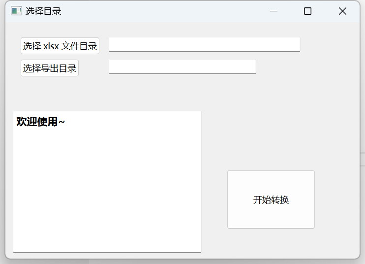

# excel2Json-py
提供给运营或者游戏策划的工具，将配置文件 —— xlsx 文件转换为 json 文件，从而把 json 配置文件提供给开发使用

## 程序截图

## 增加配置文件
* 在程序目录下新建 `settings.ini` 配置文件，参考 [`settings.example.ini`](./settings.example.ini)

## ref
* python gui https://github.com/mherrmann/fbs
* python 代码格式化 https://zhuanlan.zhihu.com/p/203307235
* https://github.com/pyqt/examples
    * https://maicss.gitbook.io/pyqt-chinese-tutoral/pyqt6
* __pycache__文件夹是什么东西？ https://zhuanlan.zhihu.com/p/476772186
* gui 打包 https://github.com/brentvollebregt/auto-py-to-exe
* python3 
    * cookbook https://python3-cookbook.readthedocs.io/zh_CN/latest/index.html#
    * https://docs.python.org/zh-cn/3/tutorial
    * https://www.liaoxuefeng.com/wiki/1016959663602400
